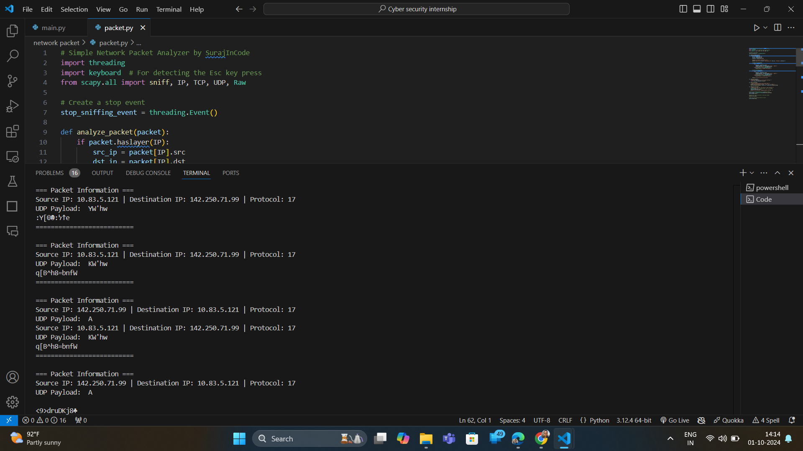

# 🕵️‍♂️ Packet Sniffer Tool

<div align="center">


A Python-based packet sniffer built using Scapy to capture and analyze network packets. Detect source and destination IP addresses, protocols, and packet payloads. Easily stop packet capturing by pressing the `Esc` key.

</div>

## 🚀 Features

- **Real-Time Packet Capture**: Sniff live network traffic in real-time and display packet information.
- **Protocol Analysis**: Analyze IP, TCP, and UDP protocols and attempt to decode payloads.
- **Cross-Platform Compatibility**: Works on major operating systems (Windows, Linux, MacOS).
- **Custom Stop Mechanism**: Capture packets until the `Esc` key is pressed to stop the sniffer safely.
- **TCP & UDP Payload**: Extract and display TCP and UDP payloads when available.

## 📸 Screenshots


*Screenshot: Displaying source/destination IP and protocol information*


## 🛠️ Technologies Used

- **Python**: Core language for implementing the packet sniffer.
- **Scapy**: Python library for sniffing, parsing, and analyzing network traffic.
- **Keyboard**: Python library to detect keyboard events (e.g., `Esc` key for stopping).
- **Threading**: Used to handle packet sniffing and user input simultaneously.

## 📋 Prerequisites

Before you run the packet sniffer, ensure the following requirements are installed:

1. **Python** (version 3.7+)
2. **Scapy** library:
   ```bash
   pip install scapy
   ```
3. **Keyboard** library:
   ```bash
   pip install keyboard
   ```
4. **Npcap** (for Windows users only):
   * Download and install Npcap, which is necessary for packet capture on Windows. Scapy uses this driver to interact with network interfaces.
   * If you see a `RuntimeError` related to WinPcap or Npcap, it's likely that Npcap is not installed.

## 📋 Installation

1. Clone this repository:
   ```bash
   git clone https://github.com/SurajInCode/packet-sniffer-tool.git
   ```

2. Navigate to the project directory:
   ```bash
   cd packet-sniffer-tool
   ```

3. Install required Python libraries:
   ```bash
   pip install -r requirements.txt
   ```

4. For **Windows** users, ensure Npcap is installed (as mentioned in Prerequisites).

5. Run the packet sniffer:
   ```bash
   python packet_sniffer.py
   ```

## ⚙️ Usage

Once the packet sniffer starts, it will capture live network traffic and display information about each packet:
* **Source IP**: The origin of the network packet.
* **Destination IP**: The target IP of the network packet.
* **Protocol**: Protocol used (e.g., TCP, UDP).
* **Payload**: TCP/UDP payload when available.

Stopping the Packet Sniffer:
Press the **Esc** key at any time to stop the packet sniffing process gracefully.

## 🔒 Disclaimer

This packet sniffer tool is for **educational purposes** only. Ensure you have permission to monitor the network traffic of any network before running the tool. Unauthorized packet sniffing is illegal and unethical.

## 🤝 Contributing

Contributions are welcome! If you find any issues or want to add new features, feel free to open an issue or submit a pull request.


## 🌐 Socials
</div>

<div align="center">

[](https://github.com/SurajInCode)

[](https://linkedin.com/in/suraj5045)
[](https://github.com/SurajInCode)
[](https://www.instagram.com/suraj.h.e/)

<a href="https://github.com/SurajInCode">
  
</a>

</div>